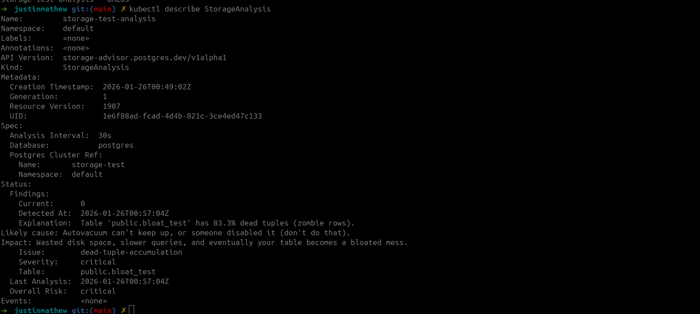

## Introduction

As I mentioned in my previous blogs, I have started learning Go and Kubernetes operators. What I realized about my softwaren engineering journey is that I love building tools and utilities and tinkering with systems. It's so fun to just change something , tweek things a little bit, and may be build something interesting in the process. This is far better athan learning DSA or watching stupid system design videos on youtube. I can sit for hours on something which I am truely interested and passionate about. 

The learning Journey with Go and Kubernetes operators has been super fun so far. I have built a few small operators and learned a lot of things in the process.

## The PostgreSQL Operator or as I call postgres-storage-advisor

## Why this supid thing?

##### Well is it really stupid?

One of the interesting things I have noticed is Hyperscalers like AWS or GCP will provide a lot of data points and metrics about the managed databases they provide. But they will not provide any details directly related to your storage layer, like bloat, and how efficiently your database is using the allocated storage. (This is what the LLMs told me, and I have no reason to doubt them).

Lets take an example of AWS. 

Do they flag HOT updates? Recently, GCP added Index Advisors. They can tell you if an index is missing, but they aren't very good at telling you if an index is harmful (i.e., blocking HOT updates).

GCP (Cloud SQL)?

Do they flag HOT updates? Recently, GCP added Index Advisors(As per the good Gemini). They can tell you if an index is missing, but they aren't very good at telling you if an index is harmful (i.e., blocking HOT updates).

### Well will see what my operator does differently here

Well let's see what my operator does differently here
It connects to your PostgreSQL database and runs some queries to get bloat information. No agents installed, no extensions required (well, except for pgstattuple if you want really precise bloat measurements). Just pure SQL queries against pg_stat_user_tables and friends.

1. It actually tells you WHY things are bad, not just THAT they're bad. This is the key difference. Most monitoring tools will show you a graph with "bloat: 45%" and leave you to figure out what to do. My operator looks at the trend over time and says things like:

"Table 'orders' HOT update ratio declined from 85% to 32% over 7 days. Likely cause: Indexes on updated columns are blocking HOT updates. Impact: More write amplification, bloated indexes, angry SSDs, and your DBA's sad face."

2. It detects patterns, not just thresholds. A static threshold like "bloat > 40% = bad" is useless. What matters is the trajectory. Is it getting worse? How fast? The operator tracks snapshots over time and calculates trends (change per day), so you can see if you need to panic now or panic later.

3. It gives you actual recommendations with safety ratings. Each finding comes with concrete actions you can take, rated by risk level:

* safe - Go ahead, run this during lunch
* requires-testing - Test in staging first
* requires-investigation - You need to understand your workload better before doing this

    For example, if it detects declining HOT updates, it might recommend: "Consider dropping indexes on frequently updated columns" with a safety level of requires-investigation because dropping indexes is... well, dropping indexes.

### The Technical Bits (for nerds like me)

#### In Action :

#### Sequence diagram(puml):

The operator is built on Kubernetes using the Operator SDK framework. Here's the architecture:

CRD (Custom Resource Definition): StorageAnalysis - you create one of these to tell the operator which database to monitor
Controller: Watches StorageAnalysis resources and reconciles every N minutes (configurable, default 5 minutes)
Collector: Connects to Postgres via pgx (pure Go driver, no CGO nonsense) and runs SQL queries to gather metrics
Analyzer: Implements pattern detection algorithms like DecliningHOTPattern, ExcessiveBloatPattern, etc.
Findings: Gets written back to the StorageAnalysis resource's status field, which you can query with kubectl
The beauty of running this as a Kubernetes operator is that it integrates naturally with existing Postgres operators like Crunchy PGO or Zalando's operator. It reads connection secrets from your existing PostgresCluster resources and starts monitoring automatically.

What I learned building this
Go is actually pretty fun once you get past the error handling. Coming from Java/Spring Boot, I initially found Go's simplicity annoying. Where's my dependency injection framework? Where's my annotations? Turns out, you don't need them. Just write functions that do things. Revolutionary, I know.

Kubernetes operators are powerful but have a learning curve. The reconciliation loop concept is brilliant but takes time to internalize. You're not thinking in terms of "run this script every 5 minutes" but rather "continuously drive the observed state towards the desired state."

PostgreSQL internals are fascinating. I spent hours reading about HOT updates, visibility maps, and the vacuum process. The more you understand how Postgres actually stores and updates data, the more you appreciate why bloat happens and why it's hard to prevent.

Good developer experience matters. I wrote a one-command setup script (setup-dev-env.sh) that creates a kind cluster, installs Crunchy PGO, creates a test database, and even has a script to generate bloat artificially. This made iteration so much faster.

What's next?
I'm planning to add:

More pattern detectors: Vacuum lag detection, excessive index bloat, TOAST bloat (for large text/jsonb columns)
LLM-enhanced explanations: Optional integration with OpenAI/Anthropic to provide even more context-aware recommendations
Alert integration: Push findings to Slack/PagerDuty when critical issues are detected
Historical dashboards: Store findings in a time-series database for long-term trend analysis
But honestly? I'm just having fun building this. Whether anyone uses it or not, I've learned a ton and had a blast doing it.

Try it yourself
The code is on GitHub  https://github.com/mathewjustin/postgres-storage-advisor.  It works with any Postgres database, whether it's running in Kubernetes via an operator or just a regular old RDS instance.

If you're into Postgres, Kubernetes, or just like tinkering with systems, give it a try. And if you find bugs (you will), feel free to roast my code in the issues.

That's it for now. Back to adding more pattern detectors and probably creating more bloat in my test database than I'll ever see in production.

How this looks in action:

— Justin

