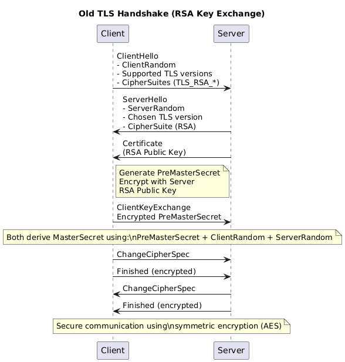

# Introduction

When you deep dive into how tls works and the underline algorithms, we will understand how much of a security issue it has from a security point of view. When I was studing of OLD Tls flow it became very obvious to me that how much of a security issue it has. In this blog post I will try to explain how tls works and what are the security issues with it. I am taking about the old tls flow here so that we can understand how the new flow fixes these issue. 

# TLS Overview

## How it works

Provide detailed explanations, examples, or narratives for the first main section.



This is the tls flow which I personally know. Essentially in the process of handshake client and server will end up creating a a symmetric key which will be used for further communication. The end goal of this handshake is to create a symmetric key which will be used for further communication. 


Where exactly shit happens?

```
Client -> Server: ClientKeyExchange
Encrypted PreMasterSecret
```

Well why shit happens? At this exact point entire session security for this session and for all future sessions depends on ONE-LONG lived secret. Which is 

```
Server RSA Private Key
```


### How and Why?

Now an attacker does this : 

1. Record encrypted traffic.
2. Wait for years. (I mean the intelligence agencies)
3. Steals the servers RSA certificate (Ah simple, put an agent employee in the company and ask them to casually copy that certificate or dump it on a screen and take a photo of it. Your keys are gone!) 
4. Replays handshake from capture
5. Decrypts PreMasterSecret
6. Derives session keys
7. Decrypts all past traffic

That's it. Game over. Lets try this out. You probably need the tcp dump and leaked key. So lets try this out 

## Reproduce this now.(Only on OLD TLS it works)

We’ll use:

    1.openssl

    2.tcpdump

    3.wireshark


#### STEP 1 — Generate RSA cert & key
    openssl genrsa -out server.key 2048

    openssl req -new -x509 \
    -key server.key \
    -out server.crt \
    -days 1 \
    -subj "/CN=localhost"

#### STEP 2 — Start an insecure RSA TLS server

This forces old RSA key exchange.

    openssl s_server \
    -accept 8443 \
    -cert server.crt \
    -key server.key \
    -cipher RSA \
    -tls1_2


⚠️ -cipher RSA is the important part.

TLS sever will look like this:


#### STEP 3 — Start tcpdump (attacker view)

In another terminal:

sudo tcpdump -i lo -w rsa_tls.pcap port 8443


Leave this running.

#### STEP 4 — Connect client & send secret data

In another terminal:

    openssl s_client \
    -connect localhost:8443 \
    -cipher RSA \
    -tls1_2


Type something sensitive:

MY_SUPER_SECRET_PASSWORD


Then press Enter. You can see on the first screenshot of the server terminal that it received the data.

Stop tcpdump:

Ctrl+C


#### STEP 5 — Decrypt the traffic in wireshark (attacker view)


Open Wireshark:

    wireshark rsa_tls.pcap


Configure RSA key

Edit → Preferences → Protocols → TLS


In RSA Keys List, add:

    IP: 127.0.0.1

    Port: 8443

    Protocol: http

    Key File: server.key (The leaked one / The one which CIA agent employee gave)


Click OK

### View decrypted traffic


The moment I adds the leaked key Wireshark decrypts everything. You can see the secret password I sent in cleartext.

# Conclusion

Old TLS is little stupid. It relies on one long lived secret (server RSA private key) to secure all sessions. If that key is compromised, all sessions past and future are compromised. You just need to pay some money to that CIA agent disguised as a DevOps engineer to get that key.

# References

ChatGPT, TLS documentation, OpenSSL documentation