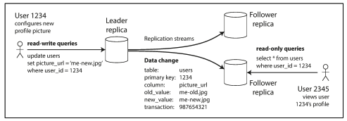
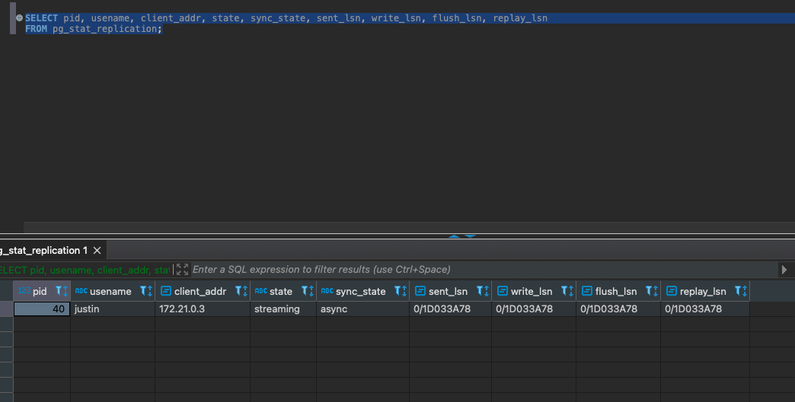

## Replication - Leaders and Followers

Replication, or read replica is a process of copy pasting data from a primary database to another database. This is done to improve performance, availability, and reliability of the database. Replication can be done in two ways: synchronous and asynchronous.

In synchronous replication, the primary database waits for the replica to acknowledge that it has received the data before it can proceed. This ensures that the data is always consistent between the primary and replica databases, but it can also slow down the performance of the primary database.

In asynchronous replication, the primary database does not wait for the replica to acknowledge that it has received the data. This allows the primary database to continue processing requests without waiting for the replica, but it can also lead to data inconsistency between the primary and replica databases.

The below image is from DDIA book. 



Talk is cheap, show me the code. 

Below is a simple docker compose file to run a leader follower setup. 

```yaml
version: '3.8'

services:
  postgres-leader:
    image: postgres:15
    container_name: pg-leader
    environment:
      POSTGRES_USER: justin
      POSTGRES_PASSWORD: secret
      POSTGRES_DB: testdb
    ports:
      - "5432:5432"
    volumes:
      - ./leader-data:/var/lib/postgresql/data
      - ./leader-init:/docker-entrypoint-initdb.d
      - ./leader-init/pg_hba.conf:/etc/postgresql/pg_hba.conf
    command: >
      postgres -c wal_level=replica
               -c max_wal_senders=10
               -c max_replication_slots=10
               -c hot_standby=on
               -c hba_file=/etc/postgresql/pg_hba.conf

  postgres-follower:
    image: postgres:15
    container_name: pg-follower
    environment:
      POSTGRES_USER: justin
      POSTGRES_PASSWORD: secret
    depends_on:
      - postgres-leader
    ports:
      - "5433:5432"
    volumes:
      - follower-data:/var/lib/postgresql/data
    entrypoint: >
      bash -c "
        until pg_isready -h pg-leader -p 5432; do echo '⏳ Waiting for leader...'; sleep 2; done \
        && echo '🚀 Starting base backup...' \
        && mkdir -p /var/lib/postgresql/data \
        && chown -R postgres:postgres /var/lib/postgresql/data \
        && chmod 0700 /var/lib/postgresql/data \
        && PGPASSWORD=secret gosu postgres pg_basebackup -h pg-leader -D /var/lib/postgresql/data -U justin -Fp -Xs -P -R \
        && echo '✅ Base backup complete. Starting follower...' \
        && exec gosu postgres postgres
      "

volumes:
  follower-data:
```

### Explanation

During the initial setup, i have faced a lot of issues. First issue was related to invalid permissions for the data directory. 
The data directory must be owned by the postgres user and have the correct permissions. The `chown` and `chmod` commands ensure that the data directory is owned by the postgres user and has the correct permissions.

Lets go through the important parts of the docker compose file.

- **Leader**:
  - `wal_level=replica`: This setting is required for replication. It ensures that the Write Ahead Log (WAL) is written in a format that can be used by replicas.
  - `max_wal_senders=10`: This setting allows up to 10 concurrent WAL sender processes. Each sender process is responsible for sending WAL data to a replica.
  - `max_replication_slots=10`: This setting allows up to 10 replication slots. Replication slots are used to keep track of which WAL files have been sent to each replica.
  - `hot_standby=on`: This setting allows read-only queries on the replica while it is in recovery mode.

- **Follower**:
  - `pg_isready`: This command checks if the leader is ready to accept connections. It waits until the leader is ready before proceeding with the base backup.
  - `pg_basebackup`: This command creates a base backup of the leader's data directory. The `-R` option creates a `recovery.conf` file in the follower's data directory, which contains the connection information for the leader.
  - `gosu postgres`: This command runs the following command as the postgres user. It is used to ensure that the commands are run with the correct permissions.

🧬 Behind the Scenes (on the Follower):

When you use:

```bash
pg_basebackup -R ...
```

It creates a file:

```bash
/var/lib/postgresql/data/standby.signal
```

Then, when you run postgres, it internally runs the equivalent of:

```bash
pg_walreceiver --connect-to=leader --stream=wal
```


Wait a minute...


Can i see this process in action. Answer is yes.
I brought up the docker compose file and then ran the 
following command to see the processes running in the leader. 

```bash

```sql
SELECT pid, usename, client_addr, state, sync_state, sent_lsn, write_lsn, flush_lsn, replay_lsn
FROM pg_stat_replication;
```

What i see is the following.



What the hell does this mean?

- **pid**: The process ID of the WAL sender process on the leader.
- **usename**: The username of the user that is connected to the leader.
- **client_addr**: The IP address of the follower.
- **state**: The current state of the connection. It can be one of the following:
  - `streaming`: The follower is receiving WAL data.
  - `catchup`: The follower is catching up to the leader.
  - `backup`: The follower is in backup mode.
- **sync_state**: The synchronization state of the follower. It can be one of the following:
  - `async`: The follower is in asynchronous mode.
  - `sync`: The follower is in synchronous mode.
  - `potential`: The follower is a potential synchronous replica.
- **sent_lsn**: The last WAL location sent to the follower.
- **write_lsn**: The last WAL location written to the follower.
- **flush_lsn**: The last WAL location flushed to the follower.
- **replay_lsn**: The last WAL location replayed on the follower.

You know the best part? For every write operation on the leader, the follower db was getting updated. Its like magic, but now you know the magic trick. 


### Conclusion

There are lot more things to explore in this area, like replication lags, replication slots, and so on. But this is a good start.

This post primarily inspired by the book [Designing Data Intensive Applications](https://dataintensive.net/) and the [Postgres Documentation](https://www.postgresql.org/docs/current/replication.html). And also Arpit Bhayani's recent tweet. 


Last but not the least thanks to all the LLMs who helped me to debug the volume mount issues.

All code here:
```
https://github.com/mathewjustin/leader-follower.git

```

Thanks,

Justin

